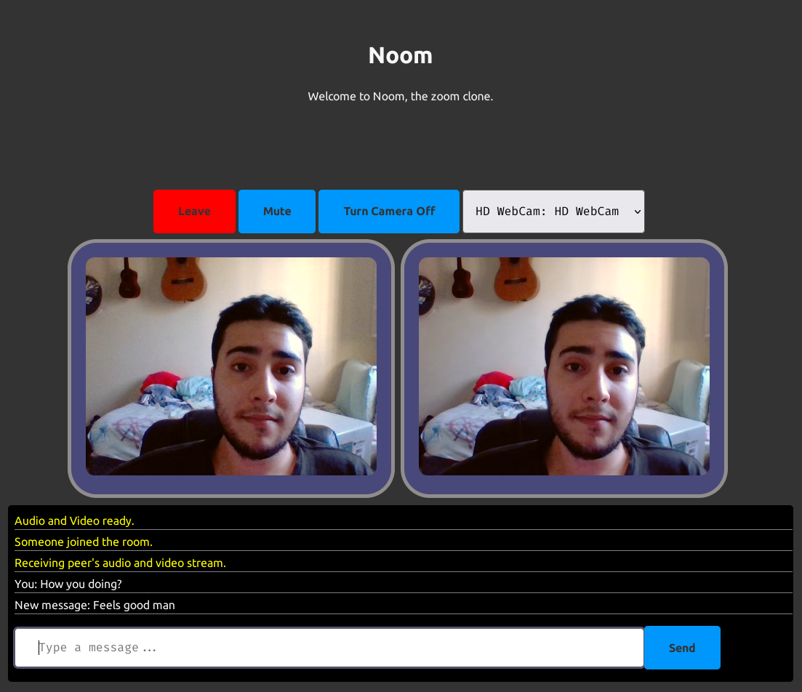

# [Nomad Coders - Zoom Clone]()

<p align="center">
  
</p>

## Table of Contents

- [About](#about)
- [Getting Started](#getting_started)
- [Notes](#notes)
- [License](#license)
- [Packages](#packages)
- [Docs](#docs)
- [Resources](#resources)

## About <a name = "about"></a>

A Zoom clone made with WebRTC and SocketIO.

- [Production App](https://zoomclone1776.herokuapp.com/)
- [Take the course too!](https://nomadcoders.co/noom)
- [Certificate of Completion](https://nomadcoders.co/certs/181c4ba0-2592-4cbb-bc3e-971d700210ef)

## Getting Started <a name = "getting_started"></a>

### Prerequisites

- `node >= 14.0.0`

### Installation

1. Clone this repo locally and install the required packages:

```bash
$ git clone https://github.com/librity/nc_zoom.git
$ cd nc_zoom
$ npm install
```

2. Start a development server:

```bash
$ npm run dev
```

3. Open http://localhost:3000 on your web browser.

#### Mobile w/ LocalTunnel

To run on mobile, start the development server
and run `localtunnel` in another shell:

```bash
$ npm i -g localtunnel
$ lt --port 3000
```

This will return a temporary https URL that tunnels to your server.

#### Format

Format all source files with Prettier:

```bash
$ npm run format
```

## Notes <a name = "notes"></a>

### WebRTC means fine Peer2Peer (W.R./M.F.P.)

> It's Toasted 🚬

Web Real-Time Communication is an API native to modern browsers
that facilitates video streaming with a peer-to-peer protocol.
It also supports `datachannel`s that let peers share arbitrary data.

<p align="center">
  
</p>

Since WebRTC doesn't have any signaling (peer discovery),
so we use a SocketIO server to establish the initial
handshake between both peers.

<p align="center">
  
</p>

The (SDP)offer contains the source address of the first peer
and details about the audio and video being shared,
like timing information and the encoding/decoding algorithm.

The second peer accepts this offer
and generates and answer.
The answer contains information about the second peer,
like its address and any ICE candidates.

An ICE candidate is a possible connection path between the peers.
As one can imagine, there are many different ways that two computers
can connect with one another, especially over long distances.
There are also considerations over which protocols are available (UDP, TCP)
and if any of the peers are using Network Address Translation.

Once both peers accepted the offer and answer
(which is like the contract of the peer to peer connection),
they choose a route/`icecandidate` that will hopefully offer
the fastest connection possible.

- https://developer.mozilla.org/en-US/docs/Glossary/SDP
- https://developer.mozilla.org/en-US/docs/Glossary/ICE
- https://en.wikipedia.org/wiki/Network_address_translation

### Scalability

<p align="center">
  
</p>

The architecture we use in this project performs
poorly with more than a couple peers.

<p align="center">
  
</p>

There are better alternatives like multipoint control unit (MCU)
and the selective forwarding unit (SFU).

- https://voximplant.com/blog/an-introduction-to-selective-forwarding-units
- https://github.com/livekit/livekit-server

### STUN Server

> STUN Servers allow clients to find out their public address,
> the type of NAT they are behind
> and the Internet side port associated
> by the NAT with a particular local port.

## License <a name = "license"></a>

This project is [MIT licensed](LICENSE).

## Packages <a name = "packages"></a>

- https://github.com/remy/nodemon/
- https://github.com/babel/babel
- https://github.com/expressjs/express
- https://github.com/pugjs/pug
- https://github.com/websockets/ws
- https://github.com/socketio/socket.io
- https://github.com/socketio/socket.io-admin-ui
- https://github.com/localtunnel/localtunnel

## Docs <a name = "docs"></a>

- https://babeljs.io/docs/en/
- https://pugjs.org/api/getting-started.html
- https://expressjs.com/en/guide/routing.html
- https://socket.io/docs/v4/
- https://developer.mozilla.org/en-US/docs/Web/API/WebSockets_API
- https://developer.mozilla.org/en-US/docs/Web/API/WebRTC_API
- https://developer.mozilla.org/en-US/docs/Web/API/RTCPeerConnection/createDataChannel

## Resources <a name = "resources"></a>

- https://www.w3schools.com/nodejs/met_path_join.asp
- https://andybrewer.github.io/mvp/?ref=producthunt
- https://admin.socket.io
- https://babel.dev/docs/en/babel-cli

### Vanilla Javascript

- https://developer.mozilla.org/en-US/docs/Web/JavaScript/Reference/Global_Objects/Map
- https://developer.mozilla.org/en-US/docs/Web/JavaScript/Reference/Global_Objects/Set
- https://developer.mozilla.org/en-US/docs/Web/API/MediaDevices/getUserMedia
- https://www.javatpoint.com/how-to-add-a-class-to-an-element-using-javascript

### WebRTC

- https://github.com/webrtc
- https://github.com/webrtc/apprtc
- https://github.com/webrtc/samples
- https://github.com/webrtc/test-pages

### Networking

- https://www.3cx.com/pbx/what-is-a-stun-server/
- https://en.wikipedia.org/wiki/Network_address_translation
- https://en.wikipedia.org/wiki/STUN

### CSS

- https://stackoverflow.com/questions/15310158/add-border-radius-to-webcam-video-element
- https://css-tricks.com/almanac/properties/b/border-radius/

### Heroku Deploy

- https://github.com/musekorea/fullstack-ZoomClone
- https://www.freecodecamp.org/news/how-to-deploy-your-site-using-express-and-heroku/
